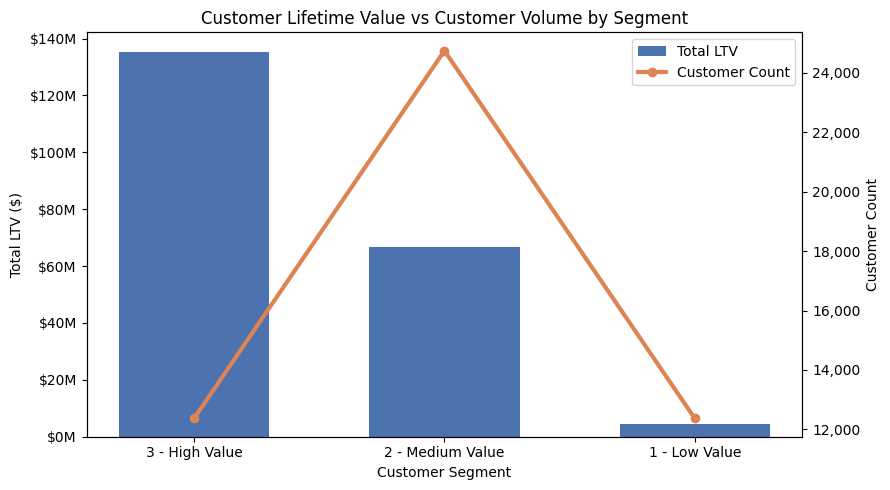
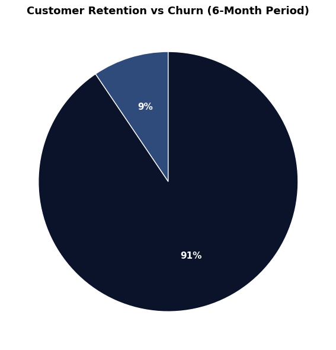
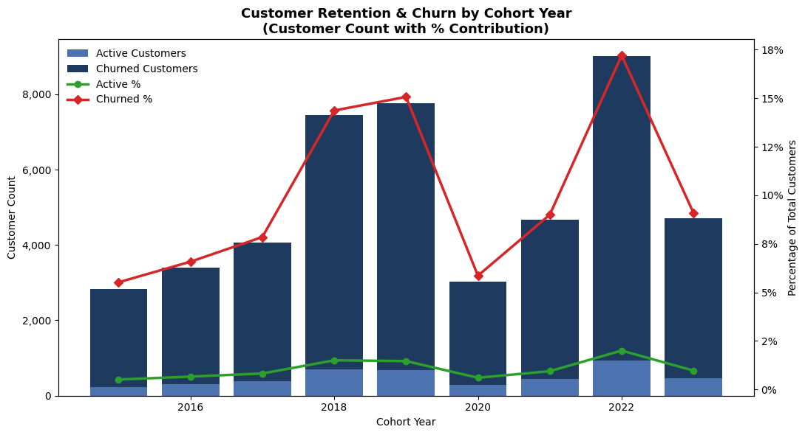

# 📊 Customer Analytics Project
### Segmentation · Cohort Analysis · Retention & Churn

---

## 🧠 Project Context
This project applies **customer analytics techniques used in real-world product and growth teams**. The goal is to transform raw transactional data into actionable insights that answer three critical business questions:
1.  **Who are our most valuable customers?** (Segmentation)
2.  **How does customer value evolve over time?** (Cohort Analysis)
3.  **When do we lose customers?** (Churn Analysis)

---

## 🛠 Tech Stack
- **Python**: Core logic and data manipulation (Pandas, NumPy).
- **Visualization**: Matplotlib and Seaborn for static, publication-quality charts.
- **SQL / Database**: PostgreSQL for data storage and querying.
- **Jupyter Notebooks**: Interactive analysis environment.

---

## 📁 Project Structure

```text
.
├── 1_Customer_Segmentation.ipynb   # Case Study 1: LTV & Segmentation
├── 2_Cohort_Analysis.ipynb         # Case Study 2: Cohort Performance
├── 3_Customer_retention.ipynb      # Case Study 3: Churn & Retention
├── assets/                         # Visualizations & Static Assets
│   ├── 1_Customer_LTV_Classes.png
│   ├── 2_Customer_Retention_pie.png
│   └── 3_Customer_Churn_Cohorts.png
└── README.md                       # Project Documentation
```

---

## 📌 Case Study 1: Customer Segmentation
**📂 Notebook:** [1_Customer_Segmentation.ipynb](1_Customer_Segmentation.ipynb)

### ❓ Case Question
> *Can customers be meaningfully segmented based on their lifetime value (LTV), and how concentrated is revenue across these groups?*

### 🎯 Objective
- Identify high, medium, and low-value customers.
- Understand the "Pareto Principle" (80/20 rule) in our revenue data.
- Enable targeted retention strategies for VIPs.

### 🔍 Analytical Approach
- **Calculated LTV**: Aggregated total revenue per customer from transactional data.
- **Percentile Ranking**: Ranked customers and split them into classes (Low: <25th, Medium: 25-75th, High: >75th percentile).
- **Comparative Analysis**: Compared the population size of each segment vs. their total revenue contribution.

### 📊 Key Visualization


*Fig 1: Distribution of customer base vs. revenue contribution. Note the disproportionate impact of high-value customers.*

### 💡 Insights
- **Revenue Concentration**: A small fraction of "High Value" customers contributes the vast majority of revenue.
- **The "Long Tail"**: "Low Value" customers make up a significant portion of the user base but contribute minimally to the bottom line.
- **Strategy**: Focus retention dollars on the "High Value" segment, as losing them is far more costly than losing "Low Value" users.

---

## 📌 Case Study 2: Customer Cohort Analysis
**📂 Notebook:** [2_Cohort_Analysis.ipynb](2_Cohort_Analysis.ipynb)

### ❓ Case Question
> *How does customer spending behavior evolve over time across different acquisition cohorts?*

### 🎯 Objective
- Analyze long-term value trends.
- Compare the performance of older vs. newer user cohorts.
- Detect if the product is getting better at monetizing users over time.

### 🔍 Analytical Approach
- **Cohort Assignment**: Grouped customers based on their acquisition year (First Purchase Date).
- **Revenue Tracking**: Calculated the average net revenue per customer for each cohort over subsequent years.
- **Trend Analysis**: Compared "All Customers" vs. "Active Spending Customers" to isolate purchasing frequency from value.

### 📊 Key Visualization


*Fig 2: Retention distribution showing the proportion of retained vs. churned customers.*

### 💡 Insights
- **Vintage Value**: Older cohorts often show higher interaction and lifetime value, likely due to survivorship bias (loyalists stay).
- **Early Drop-off**: Newer cohorts tend to have sharper drop-offs in revenue after the first year.
- **Stabilization**: Spending behavior generally stabilizes after year 2, indicating a "habit" formation.

---

## 📌 Case Study 3: Customer Retention & Churn Analysis
**📂 Notebook:** [3_Customer_retention.ipynb](3_Customer_retention.ipynb)

### ❓ Case Question
> *At what stage do customers churn the most, and how does retention differ across cohorts?*

### 🎯 Objective
- Quantify churn and identification of "high-risk" periods.
- Calculate retention rates year-over-year.
- Support proactive reactivation campaigns.

### 🔍 Analytical Approach
- **Defining Churn**: Custom logic to label users as "Churned" based on purchase inactivity gaps.
- **Status Tagging**: Tagged every customer in every year as `Active` or `Churned`.
- **Cohort Aggregation**: Calculated retention rates (% of users remaining) for each cohort year.

### 📊 Key Visualization


*Fig 3: Visualizing the decay of active user bases across different acquisition cohorts.*

### 💡 Insights
- **The "Cliff"**: The highest churn occurs immediately after the first year (the "activation to retention" gap).
- **Cohort Decay**: Retention rates inevitably decline over time, but successful products flatten this curve.
- **Action**: Introduce onboarding interventions in Year 1 to reduce the initial churn spike.

---

### 👤 Author
**Geet Purohit**
*Elevating Business Insights through Data Analysis*